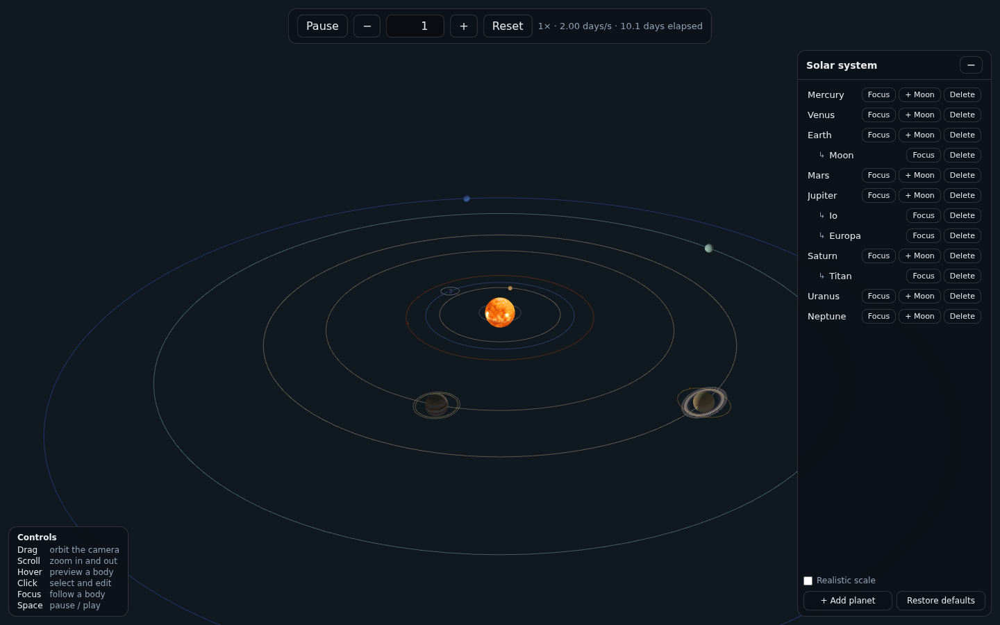
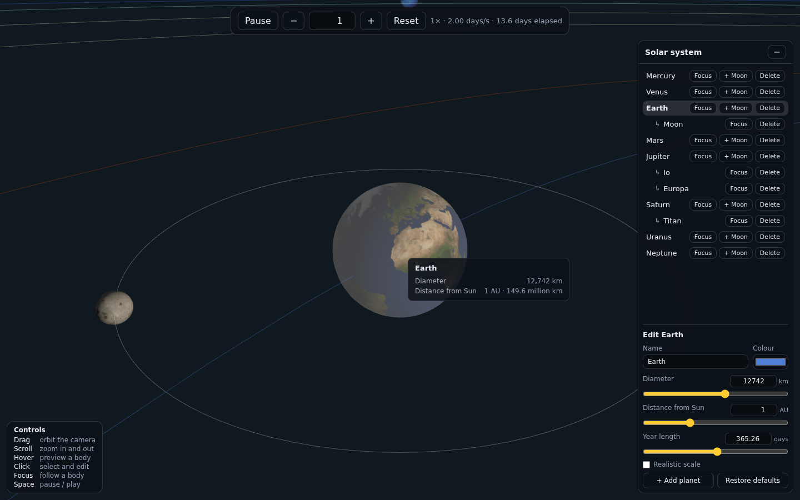

# Orbit

[](https://www.linkedin.com/in/mattias-nõgols)
[](https://github.com/mattiasnogols)
[](https://opensource.org/licenses/MIT)

A 3D, interactive model of the solar system.
> **Status:** core, time controls, hover info, focus, CRUD & textures are implemented.


## Screenshots

| Default view | Editor view |
| --- | --- |
|  |  |

## Tech stack

- **JavaScript (ESM)** - plain DOM; easy to read
- **Custom DOM** - kid-friendly panels and sliders
- **three** - scene, geometries, materials, lighting
- **Vite** - zero-config, ESM, simple production build
- **Vitest** - unit tests (scaling, orbit, time, store, scene sync, focus)
- `stats.js` - FPS check during the performance pass
- `three/addons/controls/OrbitControls.js` - orbit, zoom

## Requirements

- Node 22.12+

## Getting started

```bash
npm install
npm run dev
```

Scaffolded with:

```bash
npm create vite@latest . -- --template vanilla
npm install three
npm install -D vitest
```

## Textures

Sources and licence: `public/textures/CREDITS.md` (Solar System Scope, CC BY 4.0).

## Scaling & orbit rules

- Compress distances more than sizes so planets are not crowded near the Sun.
- "Realistic scale" toggle: linear mappings and a much larger scene; sizes and distances keep true
  relative ratios within their own mapping (the Sun keeps its fixed radius).
- Default: circular orbits, planets on the XZ plane, counter-clockwise when viewed from +Y.
- Angular speed derives directly from the editable period, so changing "year length"
  changes motion immediately.

## Design decisions

- Size and distance use separate sqrt mappings
- The Sun uses a fixed radius outside the size mapping.
- Point light at origin with `decay = 0` keeps distant planets lit; low ambient reveals night sides.

## UI layout

- Centred top time bar: Play/Pause, speed down/up buttons.
- Right-hand panel: tree of planets with moons; CRUD; "Realistic scale" toggle.

## Performance target

60 fps with the 8 planets + default moons.

## License

Released under the [MIT License](LICENSE).